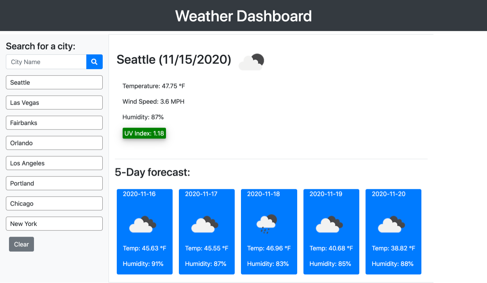

# Weather-Dashboard

## Task

The purpose of this assignment is to create a web application for the users to be able to search the weather condition of a city. The weather condition includes current weather and the incoming 5-days forecast. Current weather status of the cities will include data of temperature, wind speed, humidity, and UV index. The weather data is retrieved from OpenWeather API, and bootstrap and JQuery contribute to application appearance and functionality.  

## Acceptance Criteria

```
GIVEN a weather dashboard with form inputs
WHEN I search for a city
THEN I am presented with current and future conditions for that city and that city is added to the search history
WHEN I view current weather conditions for that city
THEN I am presented with the city name, the date, an icon representation of weather conditions, the temperature, the humidity, the wind speed, and the UV index
WHEN I view the UV index
THEN I am presented with a color that indicates whether the conditions are favorable, moderate, or severe
WHEN I view future weather conditions for that city
THEN I am presented with a 5-day forecast that displays the date, an icon representation of weather conditions, the temperature, and the humidity
WHEN I click on a city in the search history
THEN I am again presented with current and future conditions for that city
WHEN I open the weather dashboard
THEN I am presented with the last searched city forecast
```

## Appearance and Functionality

Below is an example to show how the weather data is displayed after the city is searched:



## URL sources

Feel free to check the web application: [https://ywen26.github.io/Weather-Dashboard/](https://ywen26.github.io/Weather-Dashboard/)

And github repository: [https://github.com/ywen26/Weather-Dashboard](https://github.com/ywen26/Weather-Dashboard)

## Credits

Third-Party API: OpenWeather [https://openweathermap.org/api](https://openweathermap.org/api)
